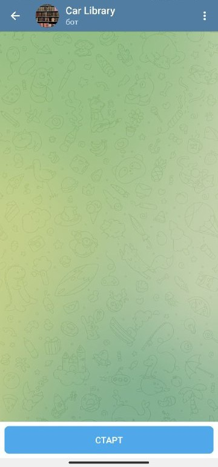
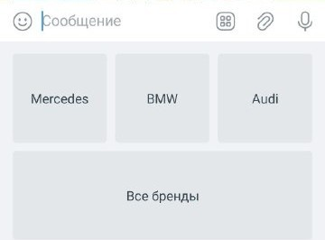
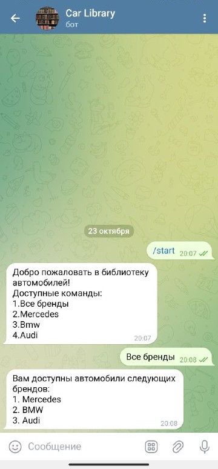
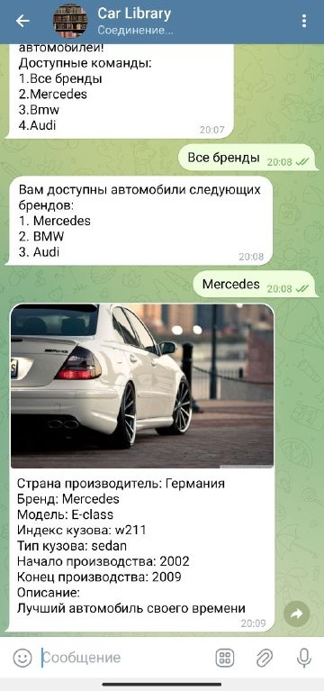
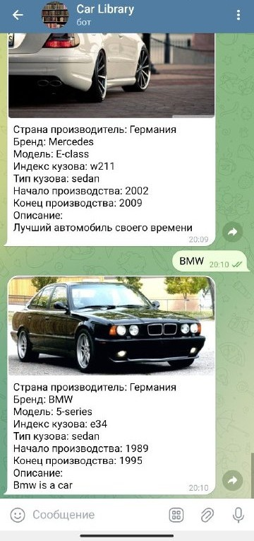
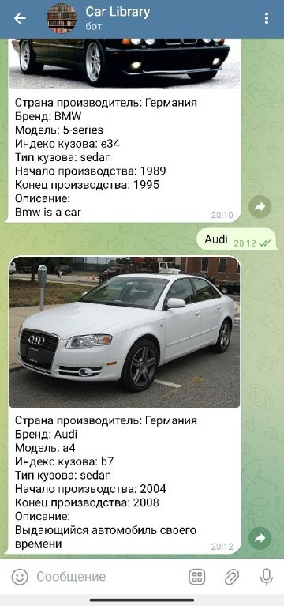

# Car Library
Car Library - это телеграм-бот, который представляет из себя библиотеку
автомобилей, позволяющий пользователям найти необходимую информацию о различных марках, 
моделях и характеристиках автомобилей.

## Содержание
- [Технологии](#Технологии)
- [Использование](#Использование)
- [Запуск приложения](#Запуск-приложения)

## Технологии

- Язык программирования: Java;
- Фреймворки и сторонние библиотеки: [CarLibraryApi](https://github.com/Reydel5212/ReydelBotAPI) Telegram API, Spring Framework, Lombok;
- База данных: PostgreSQL;
- Система контроля версий: Git;
- Сборщик проектов: Maven;

## Использование

С помощью Git Bash, перейдите в нужную папку и используя команду:

Скачайте репозиторий в выбранную Вами папку с помощью git команды:

```sh
$ git copy https://github.com/Reydel5212/ReydelBot
```

В файле "resources/application.properties", введите следующие значения:

```properties
// Введите имя своего телеграм бота
bot.name =

// Введите токен своего телеграм бота
bot.token =
```

### Создание билда 
Используя командную строку, перейдите в репозиторий проекта.
Далее, выполните следующую команду:

```sh
mvnw.cmd package // для Windows

mvnw package // для Linux 
```

### Запуск билда
После перейдите в папку target и выполните команду:

```sh
java -jar [название файла]
```

Подробнее о том, как запустить maven проект [по ссылке](https://spring-projects.ru/guides/maven/).

## Запуск приложения

Приложение запускается вместе с CarLibraryApi - [ссылка](https://github.com/Reydel5212/ReydelBotAPI).

Подобным образом выглядит иконка в чат-селекторе.


После входа в чат, Вы обнаружите панель с кнопкой "Старт".
Когда вы нажмете на нее, бот запустится.



Бот предоставляет нам клавиатуру, на которой отображаются доступные команды.



При первом запуске бота, в чате автоматически активируется команда "/start".
В ответ бот отправит приветственное сообщение.

После нажатия на кнопку "Все бренды", бот пришлет нам сообщение, 
содержащее перечень доступных автомобильных брендов.

После выбора желаемого бренда, бот отправит нам изображение атвомобиля с его техническими характеристиками.



При выборе "Mercedes":



При выборе "Bmw":



При выборе "Audi":


